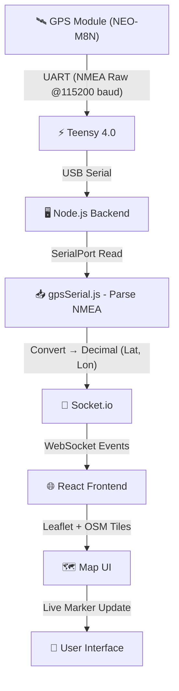
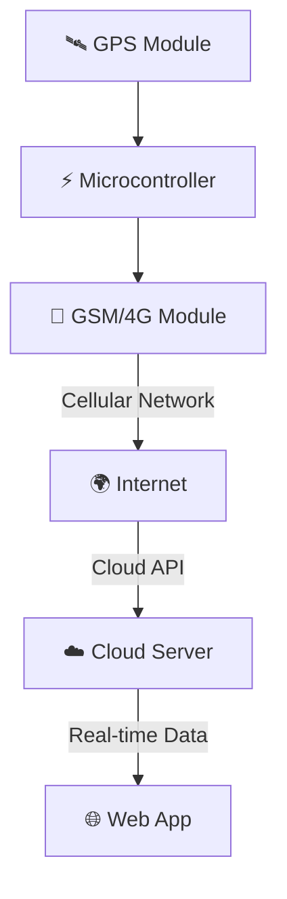

# 📍 Live GPS Tracking System (Teensy + Node.js + React + Leaflet)


---

## 🚀 Project Description

This project is a **real-time GPS tracking system** that integrates hardware and web technologies to display live location data on an interactive map.

The system reads raw GPS data from a hardware module and visualizes it on a web interface with smooth, real-time updates—similar to applications like Google Maps or Uber tracking.

---

## 🧠 System Architecture (End-to-End Flow)



---

## 🔧 Technologies Used

### 🟢 Hardware

* **NEO-M8N GPS Module**

  * Multi-GNSS support (GPS + GLONASS)
  * High accuracy (~1–2 meters)
  * Outputs raw NMEA data

* **Teensy 4.0**

  * Reads GPS via UART communication
  * Receives raw NMEA data at **115200 baud rate**
  * Sends data to backend via USB serial

---

### 🔵 Backend (Node.js)

* **Express.js** → Server setup
* **Socket.io** → Real-time communication
* **SerialPort** → Reads data from USB serial
* **gpsSerial.js** → Handles raw data parsing

---

### 🟣 Frontend (React)

* **React (Vite)** → Fast frontend framework
* **React-Leaflet** → Map rendering
* **OpenStreetMap (OSM)** → Free tile-based map
* **Socket.io-client** → Receives live updates

---

## ⚙️ Core Features

### 📡 Real-Time GPS Tracking

* Continuous live updates of latitude and longitude
* No page refresh required

---

### 🗺️ Interactive Map

* Zoom, pan, and drag controls
* Maximum zoom level up to 19
* Smooth user interaction

---

### 📍 Live Marker Movement

* Marker updates in real time
* Smooth transitions without jitter

---

### 🔁 Follow Mode (Smart Tracking)

* 🟢 Follow ON → Map auto-centers on GPS position
* 🔴 Follow OFF → User can explore freely

---

### ✨ Smooth Movement System

* Noise filtering (ignores small fluctuations)
* Linear interpolation (LERP)
* Smooth animations using `panTo()`

---

## 🧠 GPS Data Flow & Processing

### 📥 Step 1: Raw Data from GPS

```text
$GNRMC,105202.00,A,2324.50947,N,08731.86070,E,...
```

---

### 🔄 Step 2: Teensy → Backend

* Teensy forwards raw NMEA data via USB serial
* Node.js reads using SerialPort

---

### 🧩 Step 3: Parsing in `gpsSerial.js`

* Extracts NMEA fields
* Converts to decimal coordinates

```js
decimal = degrees + (minutes / 60)
```

---

### ✅ Step 4: Final Output

```text
Latitude: 23.4085
Longitude: 87.5310
```

---

### 📤 Step 5: Send to Frontend

* Data sent via Socket.io
* React updates map in real time

---

## 📁 Project Structure

```text
Live_Location_Tracker/
│
├── Backend/
│   ├── server.js
│   └── gpsSerial.js
│
├── frontend/
│   ├── src/
│   │   ├── MapComponent.jsx
│   │   ├── main.jsx
│   │   └── App.jsx
│   │
│   └── package.json
│
├── README.md
└── LICENSE
```

---

## ▶️ Setup & Installation

### Backend

```bash
cd Backend
npm install
npm start
```

### Frontend

```bash
cd frontend
npm install
npm run dev
```

---

## ⚠️ Important Configuration

```js
path: "/dev/ttyACM0"
```

```bash
ls /dev/ttyACM*
sudo chmod 666 /dev/ttyACM0
```

```js
import "leaflet/dist/leaflet.css";
```

---

## 🧪 Debugging Tips

* Backend:

  * `RAW:` → incoming GPS data
  * `PARSED:` → processed coordinates

* Frontend:

  * `Received:` → socket data

---

## 🚀 Performance Optimizations

* Noise filtering (≤ 3m)
* Smooth interpolation
* Efficient tile loading
* WebSocket real-time updates

---

## 🔮 Future Enhancements

### 🌐 Wireless Real-Time Tracking (GSM/IoT Upgrade)

In future, this system can be upgraded into a **fully wireless GPS tracking system** by integrating a GSM/4G module (SIM800, SIM7600, etc.).



#### 🚀 Concept:

* Wireless GPS data transmission
* Cloud-hosted backend
* Global real-time tracking

#### 💡 Benefits:

* Fully portable
* No USB required
* Scalable IoT system

---

## 💡 Use Cases

* Vehicle tracking
* Drone navigation
* Logistics
* Robotics
* Personal tracking

---

## 💥 Conclusion

✔️ Real-time GPS tracking
✔️ Smooth UI
✔️ Scalable architecture

Perfect for real-world applications 🚀

---

## 📜 License

**License: Custom Non-Commercial**

📄 Full License: [View LICENSE](./LICENSE)

This project is licensed under a **Custom Non-Commercial License**.

### ✅ Allowed (Free Use)

* Personal use
* Educational use
* Learning and experimentation

### ❌ Not Allowed

* Commercial use without permission
* Selling or distributing for profit

### 💰 Commercial Use

If you want to use this project for **business or commercial purposes**, you must:

* Contact the author
* Pay a licensing fee
* Provide proper credit

### 📧 Contact

For commercial licensing:
[arahamabeddin7@gmail.com](mailto:arahamabeddin7@gmail.com)

---

⚠️ Unauthorized commercial use is strictly prohibited.

---
