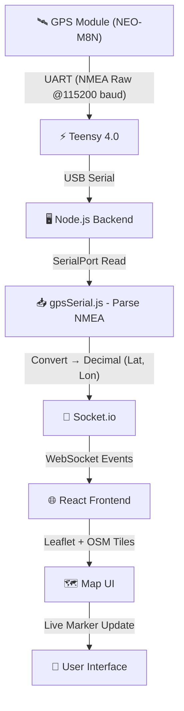
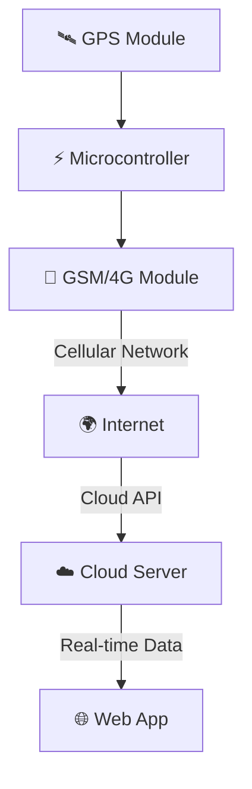

# 📍 Live GPS Tracking System (Teensy + Node.js + React + Leaflet)

---

## 🚀 Project Description

This project is a **real-time GPS tracking system** that integrates hardware and web technologies to display live location data on an interactive map.

The system reads raw GPS data from a hardware module and visualizes it on a web interface with smooth, real-time updates—similar to applications like Google Maps or Uber tracking.

---

## 🧠 System Architecture (End-to-End Flow)



---

## 🔧 Technologies Used

### 🟢 Hardware

* **NEO-M8N GPS Module**

  * Multi-GNSS support (GPS + GLONASS)
  * High accuracy (~1–2 meters)
  * Outputs raw NMEA data

* **Teensy 4.0**

  * Reads GPS via UART communication
  * Receives raw NMEA data at **115200 baud rate**
  * Sends data to backend via USB serial

---

### 🔵 Backend (Node.js)

* **Express.js** → Server setup
* **Socket.io** → Real-time communication
* **SerialPort** → Reads data from USB serial
* **gpsSerial.js** → Handles raw data parsing

---

### 🟣 Frontend (React)

* **React (Vite)** → Fast frontend framework
* **React-Leaflet** → Map rendering
* **OpenStreetMap (OSM)** → Free tile-based map
* **Socket.io-client** → Receives live updates

---

## ⚙️ Core Features

### 📡 Real-Time GPS Tracking

* Continuous live updates of latitude and longitude
* No page refresh required

---

### 🗺️ Interactive Map

* Zoom, pan, and drag controls
* Maximum zoom level up to 19
* Smooth user interaction

---

### 📍 Live Marker Movement

* Marker updates in real time
* Smooth transitions without jitter

---

### 🔁 Follow Mode (Smart Tracking)

* 🟢 Follow ON → Map auto-centers on GPS position
* 🔴 Follow OFF → User can explore freely

---

### ✨ Smooth Movement System

* Noise filtering (ignores small fluctuations)
* Linear interpolation (LERP)
* Smooth animations using `panTo()`

---

## 🧠 GPS Data Flow & Processing

### 📥 Step 1: Raw Data from GPS

The GPS module sends **raw NMEA sentences** to Teensy via UART at **115200 baud rate**:

```text
$GNRMC,105202.00,A,2324.50947,N,08731.86070,E,...
```

---

### 🔄 Step 2: Teensy → Backend

* Teensy forwards this raw NMEA data to the system via USB serial
* Node.js backend reads this stream using `SerialPort`

---

### 🧩 Step 3: Parsing in `gpsSerial.js`

The backend file **`gpsSerial.js`**:

* Extracts useful fields from NMEA sentences
* Converts raw format into decimal coordinates

#### Conversion Logic:

* Latitude format: `DDMM.MMMM`
* Longitude format: `DDDMM.MMMM`

```js
decimal = degrees + (minutes / 60)
```

---

### ✅ Step 4: Final Output

```text
Latitude: 23.4085
Longitude: 87.5310
```

---

### 📤 Step 5: Send to Frontend

* Parsed data is emitted using Socket.io
* React frontend receives and updates the map

---

## 📁 Project Structure

```text
Live_Location_Tracker/
│
├── Backend/
│   ├── server.js        # Express + Socket.io server
│   └── gpsSerial.js     # Serial handling + GPS parsing
│
├── frontend/
│   ├── src/
│   │   ├── MapComponent.jsx   # Main map component
│   │   ├── main.jsx           # Entry point
│   │   └── App.jsx
│   │
│   └── package.json
│
└── README.md
```

---

## ▶️ Setup & Installation

### 🟢 Backend Setup

```bash
cd Backend
npm install
npm start
```

---

### 🟣 Frontend Setup

```bash
cd frontend
npm install
npm run dev
```

---

## ⚠️ Important Configuration

### 🔌 Serial Port

```js
path: "/dev/ttyACM0"
```

Check available ports:

```bash
ls /dev/ttyACM*
```

---

### 🔐 Permission Fix (Linux)

```bash
sudo chmod 666 /dev/ttyACM0
```

---

### 🎨 Leaflet CSS (Required)

```js
import "leaflet/dist/leaflet.css";
```

---

## 🧪 Debugging Tips

* Backend logs:

  * `RAW:` → raw NMEA data
  * `PARSED:` → converted coordinates

* Frontend logs:

  * `Received:` → incoming GPS data

### Common Issues

* ❌ Wrong baud rate
* ❌ No GPS fix (`V` instead of `A`)
* ❌ Missing TileLayer → blank map

---

## 🚀 Performance Optimizations

* Noise filtering (ignore ≤ 3 meters)
* Smooth interpolation (LERP)
* Efficient tile loading
* WebSocket-based real-time updates

---

## 🔮 Future Enhancements

### 🌐 Wireless Real-Time Tracking (GSM/IoT Upgrade)

In future, this system can be upgraded into a **fully wireless GPS tracking system** by integrating a GSM/4G module (like SIM800, SIM7600, etc.).



#### 🚀 Concept:

* GPS data will be transmitted wirelessly via GSM/4G network
* A **cloud server (AWS / VPS / Render / Railway, etc.)** will host the backend
* Enables **global real-time tracking from anywhere**

#### 💡 Benefits:

* Fully wireless system
* No USB dependency
* Scalable for multiple devices
* Suitable for real-world IoT deployment

---

## 💡 Use Cases

* 🚗 Vehicle tracking systems
* 🚁 Drone navigation
* 📦 Logistics tracking
* 🤖 Robotics projects
* 🧭 Personal GPS tracking

---

## 💥 Conclusion

This project demonstrates a **complete real-time GPS tracking system** where:

* Raw GPS data (NMEA @115200 baud) is captured
* Parsed into usable coordinates in the backend
* Transmitted in real time
* Visualized smoothly on a web-based map

✔️ Accurate
✔️ Real-time
✔️ Scalable

Perfect for learning and real-world applications 🚀

---
