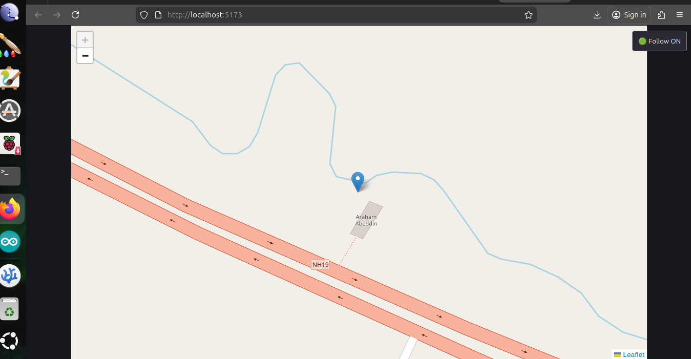
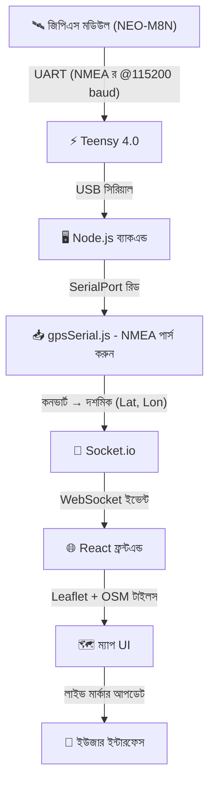
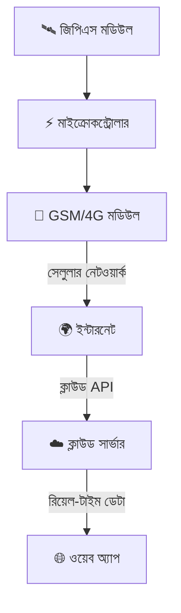

# 📍 লাইভ জিপিএস ট্র্যাকিং সিস্টেম (Teensy + Node.js + React + Leaflet)


## 🌐 উপলব্ধ ভাষা

* 🇺🇸 [English](./README.md)
* 🇮🇳 [Hindi](./README.hi.md)
* 🇧🇩 Bengali (current)

---

## 🚀 প্রকল্পের বিবরণ

এই প্রকল্পটি একটি **রিয়েল-টাইম জিপিএস ট্র্যাকিং সিস্টেম** যা হার্ডওয়্যার এবং ওয়েব প্রযুক্তি একত্রিত করে লাইভ লোকেশন ডেটা একটি ইন্টারঅ্যাকটিভ মানচিত্রে প্রদর্শন করে।

সিস্টেমটি হার্ডওয়্যার মডিউল থেকে কাঁচা জিপিএস ডেটা পড়ে এবং ওয়েব ইন্টারফেসে মসৃণ, রিয়েল-টাইম আপডেট সহ প্রদর্শন করে – গুগল ম্যাপ বা উবার ট্র্যাকিংয়ের মতো।

---

## 📸 লাইভ ডেমো প্রিভিউ

<p align="center">
  
</p>

---

## 🧠 সিস্টেম আর্কিটেকচার (এন্ড-টু-এন্ড ফ্লো)



---

## 🔌 Teensy + জিপিএস ওয়্যারিং এবং কোড

### 🔗 ওয়্যারিং (NEO-M8N ↔ Teensy 4.0)

| জিপিএস মডিউল | Teensy 4.0               |
| ---------- | ------------------------ |
| VCC        | 3.3V / 5V                |
| GND        | GND                      |
| TX         | Pin 0 (RX1)              |
| RX         | Pin 1 (TX1) *(ঐচ্ছিক)* |

👉 বেসিক সংযোগ:

* জিপিএস TX → Teensy RX (Pin 0) ✔️
* জিপিএস RX ঐচ্ছিক

---

### 💻 Teensy কোড (UART @115200)

```cpp
void setup() {
  Serial.begin(115200);     // PC
  Serial1.begin(115200);    // জিপিএস-ও 115200 ব্যবহার করছে

  Serial.println("GPS Data Start...");
}

void loop() {
  while (Serial1.available()) {
    char c = Serial1.read();
    Serial.print(c);
  }
}
```

👉 এই কোড:

* জিপিএসের কাঁচা NMEA ডেটা পড়ে
* USB সিরিয়ালের মাধ্যমে ব্যাকএন্ডে ফরওয়ার্ড করে

---

## 🔧 ব্যবহৃত প্রযুক্তি

### 🟢 হার্ডওয়্যার

* **NEO-M8N জিপিএস মডিউল**

  * মাল্টি-GNSS সাপোর্ট (জিপিএস + গ্লোনাস)
  * উচ্চ নির্ভুলতা (~1–2 মিটার)
  * কাঁচা NMEA ডেটা আউটপুট

* **Teensy 4.0**

  * UART এর মাধ্যমে জিপিএস পড়ে
  * **115200 baud রেটে** কাঁচা NMEA ডেটা গ্রহণ করে
  * USB সিরিয়ালের মাধ্যমে ব্যাকএন্ডে ডেটা পাঠায়

---

### 🔵 ব্যাকএন্ড (Node.js)

* **Express.js** → সার্ভার সেটআপ
* **Socket.io** → রিয়েল-টাইম যোগাযোগ
* **SerialPort** → USB সিরিয়াল থেকে ডেটা পড়ে
* **gpsSerial.js** → কাঁচা ডেটা পার্সিং হ্যান্ডল করে

---

### 🟣 ফ্রন্টএন্ড (React)

* **React (Vite)** → দ্রুত ফ্রন্টএন্ড ফ্রেমওয়ার্ক
* **React-Leaflet** → মানচিত্র রেন্ডারিং
* **OpenStreetMap (OSM)** → ফ্রি টাইল-ভিত্তিক মানচিত্র
* **Socket.io-client** → লাইভ আপডেট গ্রহণ করে

---

## ⚙️ মূল বৈশিষ্ট্য

### 📡 রিয়েল-টাইম জিপিএস ট্র্যাকিং

* ক্রমাগত লাইভ আপডেট (অক্ষাংশ এবং দ্রাঘিমাংশ)
* কোনো পৃষ্ঠা রিফ্রেশের প্রয়োজন নেই

---

### 🗺️ ইন্টারঅ্যাকটিভ মানচিত্র

* জুম, প্যান এবং ড্র্যাগ নিয়ন্ত্রণ
* সর্বোচ্চ জুম স্তর 19
* মসৃণ ব্যবহারকারীর অভিজ্ঞতা

---

### 📍 লাইভ মার্কার মুভমেন্ট

* মার্কার রিয়েল টাইমে আপডেট হয়
* ঝাঁকুনি ছাড়া মসৃণ পরিবর্তন

---

### 🔁 ফলো মোড (স্মার্ট ট্র্যাকিং)

* 🟢 ফলো অন → মানচিত্র জিপিএস অবস্থানে অটো-সেন্টার হয়
* 🔴 ফলো অফ → ব্যবহারকারী স্বাধীনভাবে অন্বেষণ করতে পারেন

---

### ✨ মসৃণ মুভমেন্ট সিস্টেম

* নয়েজ ফিল্টারিং (ছোট ওঠানামা উপেক্ষা করে)
* লিনিয়ার ইন্টারপোলেশন (LERP)
* `panTo()` ব্যবহার করে মসৃণ অ্যানিমেশন

---

## 🧠 জিপিএস ডেটা ফ্লো এবং প্রক্রিয়াকরণ

### 📥 ধাপ 1: জিপিএস থেকে কাঁচা ডেটা

```text
$GNRMC,105202.00,A,2324.50947,N,08731.86070,E,...
```

---

### 🔄 ধাপ 2: Teensy → ব্যাকএন্ড

* Teensy USB সিরিয়ালের মাধ্যমে কাঁচা NMEA ডেটা ফরওয়ার্ড করে
* Node.js SerialPort ব্যবহার করে পড়ে

---

### 🧩 ধাপ 3: `gpsSerial.js` এ পার্সিং

* NMEA ফিল্ড বের করে
* দশমিক স্থানাঙ্কে রূপান্তর করে

```js
decimal = degrees + (minutes / 60)
```

---

### ✅ ধাপ 4: চূড়ান্ত আউটপুট

```text
অক্ষাংশ (Latitude): 23.4085
দ্রাঘিমাংশ (Longitude): 87.5310
```

---

### 📤 ধাপ 5: ফ্রন্টএন্ডে পাঠান

* ডেটা Socket.io এর মাধ্যমে পাঠানো হয়
* React রিয়েল টাইমে মানচিত্র আপডেট করে

---

## 📁 প্রকল্পের কাঠামো

```text
Live_Location_Tracker/
│
├── Backend/
│   ├── server.js
│   └── gpsSerial.js
│
├── frontend/
│   ├── src/
│   │   ├── MapComponent.jsx
│   │   ├── main.jsx
│   │   └── App.jsx
│   │
│   └── package.json
│
├── assets/
│   └── Live_location_update_Image.png
│
├── README.md
├── README.hi.md
├── README.bn.md
└── LICENSE
```

---

## ▶️ সেটআপ এবং ইনস্টলেশন

### ব্যাকএন্ড

```bash
cd Backend
npm install
npm start
```

### ফ্রন্টএন্ড

```bash
cd frontend
npm install
npm run dev
```

---

## ⚠️ গুরুত্বপূর্ণ কনফিগারেশন

```js
path: "/dev/ttyACM0"
```

```bash
ls /dev/ttyACM*
sudo chmod 666 /dev/ttyACM0
```

```js
import "leaflet/dist/leaflet.css";
```

---

## 🧪 ডিবাগিং টিপস

* ব্যাকএন্ড:

  * `RAW:` → আগত জিপিএস ডেটা
  * `PARSED:` → প্রক্রিয়াকৃত স্থানাঙ্ক

* ফ্রন্টএন্ড:

  * `Received:` → সকেট ডেটা

---

## 🚀 পারফরম্যান্স অপটিমাইজেশন

* নয়েজ ফিল্টারিং (≤ 3 মিটার)
* মসৃণ ইন্টারপোলেশন
* দক্ষ টাইল লোডিং
* WebSocket রিয়েল-টাইম আপডেট

---

## 🔮 ভবিষ্যতের উন্নয়ন

### 🌐 ওয়্যারলেস রিয়েল-টাইম ট্র্যাকিং (GSM/IoT আপগ্রেড)

ভবিষ্যতে, এই সিস্টেমটিকে একটি GSM/4G মডিউল (SIM800, SIM7600, ইত্যাদি) সংহত করে **সম্পূর্ণ ওয়্যারলেস জিপিএস ট্র্যাকিং সিস্টেমে** আপগ্রেড করা যেতে পারে।



#### 🚀 ধারণা:

* ওয়্যারলেস জিপিএস ডেটা ট্রান্সমিশন
* ক্লাউড-হোস্টেড ব্যাকএন্ড
* বৈশ্বিক রিয়েল-টাইম ট্র্যাকিং

#### 💡 সুবিধা:

* সম্পূর্ণ পোর্টেবল
* ইউএসবি প্রয়োজন হয় না
* স্কেলেবল আইওটি সিস্টেম

---

## 💡 ব্যবহারের ক্ষেত্র

* যানবাহন ট্র্যাকিং
* ড্রোন নেভিগেশন
* লজিস্টিকস
* রোবোটিক্স
* ব্যক্তিগত ট্র্যাকিং

---

## 💥 উপসংহার

✔️ রিয়েল-টাইম জিপিএস ট্র্যাকিং
✔️ মসৃণ ইউআই
✔️ স্কেলেবল আর্কিটেকচার

বাস্তব-বিশ্বের অ্যাপ্লিকেশনের জন্য উপযুক্ত 🚀

---

## 📜 লাইসেন্স

**লাইসেন্স: কাস্টম নন-কমার্শিয়াল**

📄 সম্পূর্ণ লাইসেন্স: [LICENSE দেখুন](./LICENSE)

এই প্রকল্পটি একটি **কাস্টম নন-কমার্শিয়াল লাইসেন্স** এর অধীনে লাইসেন্সপ্রাপ্ত।

### ✅ অনুমোদিত (বিনামূল্যে ব্যবহার)

* ব্যক্তিগত ব্যবহার
* শিক্ষামূলক ব্যবহার
* শেখা এবং পরীক্ষা-নিরীক্ষা

### ❌ অনুমোদিত নয়

* অনুমতি ছাড়া বাণিজ্যিক ব্যবহার
* লাভের জন্য বিক্রি বা বিতরণ

### 💰 বাণিজ্যিক ব্যবহার

আপনি যদি এই প্রকল্পটি **ব্যবসা বা বাণিজ্যিক উদ্দেশ্যে** ব্যবহার করতে চান, তাহলে আপনাকে অবশ্যই:

* লেখকের সাথে যোগাযোগ করুন
* লাইসেন্স ফি প্রদান করুন
* যথাযথ কৃতিত্ব প্রদান করুন

### 📧 যোগাযোগ করুন

বাণিজ্যিক লাইসেন্সিংয়ের জন্য:
[arahamabeddin7@gmail.com](mailto:arahamabeddin7@gmail.com)

---

⚠️ অননুমোদিত বাণিজ্যিক ব্যবহার কঠোরভাবে নিষিদ্ধ।
```

---