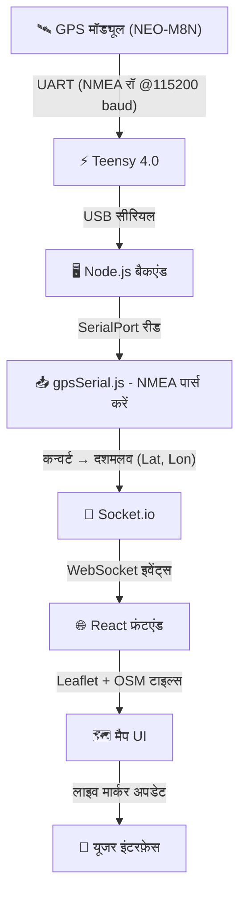
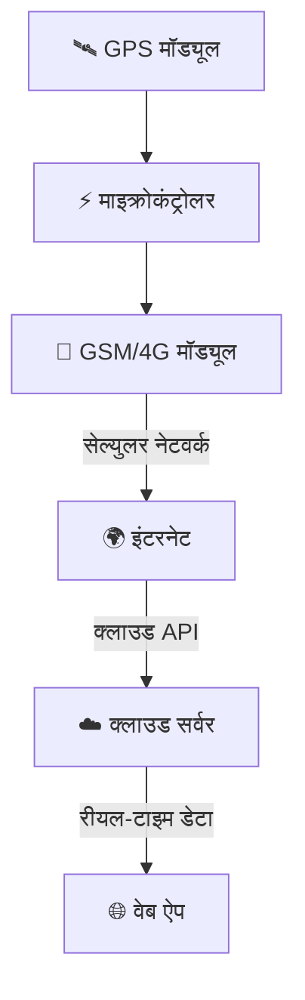

# 📍 लाइव GPS ट्रैकिंग सिस्टम (Teensy + Node.js + React + Leaflet)


## 🌐 उपलब्ध भाषाएँ

* 🇺🇸 [English](./README.md)
* 🇮🇳 Hindi(current)
* 🇧🇩 [Bengali](./README.bn.md)

---

## 🚀 प्रोजेक्ट विवरण

यह प्रोजेक्ट एक **रीयल-टाइम GPS ट्रैकिंग सिस्टम** है जो हार्डवेयर और वेब तकनीकों को जोड़ता है ताकि लाइव लोकेशन डेटा को इंटरैक्टिव मैप पर दिखाया जा सके।

सिस्टम हार्डवेयर मॉड्यूल से कच्चा GPS डेटा पढ़ता है और उसे वेब इंटरफ़ेस पर स्मूथ, रीयल-टाइम अपडेट के साथ प्रदर्शित करता है – ठीक Google Maps या Uber ट्रैकिंग की तरह।

---

## 📸 लाइव डेमो पूर्वावलोकन

<p align="center">
  
</p>

---

## 🧠 सिस्टम आर्किटेक्चर (एंड-टू-एंड फ्लो)



---

## 🔌 Teensy + GPS वायरिंग और कोड

### 🔗 वायरिंग (NEO-M8N ↔ Teensy 4.0)

| GPS मॉड्यूल | Teensy 4.0               |
| ---------- | ------------------------ |
| VCC        | 3.3V / 5V                |
| GND        | GND                      |
| TX         | Pin 0 (RX1)              |
| RX         | Pin 1 (TX1) *(वैकल्पिक)* |

👉 बेसिक कनेक्शन:

* GPS TX → Teensy RX (Pin 0) ✔️
* GPS RX वैकल्पिक है

---

### 💻 Teensy कोड (UART @115200)

```cpp
void setup() {
  Serial.begin(115200);     // PC
  Serial1.begin(115200);    // GPS भी 115200 इस्तेमाल कर रहा है

  Serial.println("GPS Data Start...");
}

void loop() {
  while (Serial1.available()) {
    char c = Serial1.read();
    Serial.print(c);
  }
}
```

👉 यह कोड:

* GPS का रॉ NMEA डेटा पढ़ता है
* USB सीरियल के ज़रिए बैकएंड को भेजता है

---

## 🔧 उपयोग की गई तकनीकें

### 🟢 हार्डवेयर

* **NEO-M8N GPS मॉड्यूल**

  * मल्टी-GNSS सपोर्ट (GPS + GLONASS)
  * उच्च सटीकता (~1–2 मीटर)
  * रॉ NMEA डेटा आउटपुट

* **Teensy 4.0**

  * UART के ज़रिए GPS पढ़ता है
  **115200 बॉड रेट** पर रॉ NMEA डेटा प्राप्त करता है
  * USB सीरियल के ज़रिए बैकएंड को डेटा भेजता है

---

### 🔵 बैकएंड (Node.js)

* **Express.js** → सर्वर सेटअप
* **Socket.io** → रीयल-टाइम कम्युनिकेशन
* **SerialPort** → USB सीरियल से डेटा पढ़ता है
* **gpsSerial.js** → रॉ डेटा पार्सिंग हैंडल करता है

---

### 🟣 फ्रंटएंड (React)

* **React (Vite)** → तेज़ फ्रंटएंड फ्रेमवर्क
* **React-Leaflet** → मैप रेंडरिंग
* **OpenStreetMap (OSM)** → मुफ्त टाइल-आधारित मैप
* **Socket.io-client** → लाइव अपडेट प्राप्त करता है

---

## ⚙️ मुख्य विशेषताएँ

### 📡 रीयल-टाइम GPS ट्रैकिंग

* लगातार लाइव अपडेट (अक्षांश और देशांतर)
* कोई पेज रिफ्रेश ज़रूरी नहीं

---

### 🗺️ इंटरैक्टिव मैप

* ज़ूम, पैन और ड्रैग नियंत्रण
* अधिकतम ज़ूम स्तर 19
* सहज उपयोगकर्ता अनुभव

---

### 📍 लाइव मार्कर मूवमेंट

* मार्कर रीयल टाइम में अपडेट होता है
* बिना झटके के स्मूथ ट्रांज़िशन

---

### 🔁 फॉलो मोड (स्मार्ट ट्रैकिंग)

* 🟢 फॉलो ऑन → मैप GPS पोजीशन पर ऑटो-सेंटर होता है
* 🔴 फॉलो ऑफ → उपयोगकर्ता स्वतंत्र रूप से एक्सप्लोर कर सकता है

---

### ✨ स्मूथ मूवमेंट सिस्टम

* नॉइज़ फ़िल्टरिंग (छोटे उतार-चढ़ाव को नज़रअंदाज़ करता है)
* लीनियर इंटरपोलेशन (LERP)
* `panTo()` का उपयोग कर स्मूथ एनिमेशन

---

## 🧠 GPS डेटा फ्लो और प्रोसेसिंग

### 📥 चरण 1: GPS से रॉ डेटा

```text
$GNRMC,105202.00,A,2324.50947,N,08731.86070,E,...
```

---

### 🔄 चरण 2: Teensy → बैकएंड

* Teensy USB सीरियल के ज़रिए रॉ NMEA डेटा भेजता है
* Node.js SerialPort का उपयोग करके पढ़ता है

---

### 🧩 चरण 3: `gpsSerial.js` में पार्सिंग

* NMEA फ़ील्ड निकालता है
* दशमलव निर्देशांक में बदलता है

```js
decimal = degrees + (minutes / 60)
```

---

### ✅ चरण 4: अंतिम आउटपुट

```text
अक्षांश (Latitude): 23.4085
देशांतर (Longitude): 87.5310
```

---

### 📤 चरण 5: फ्रंटएंड पर भेजें

* डेटा Socket.io के ज़रिए भेजा जाता है
* React रीयल टाइम में मैप अपडेट करता है

---

## 📁 प्रोजेक्ट संरचना

```text
Live_Location_Tracker/
│
├── Backend/
│   ├── server.js
│   └── gpsSerial.js
│
├── frontend/
│   ├── src/
│   │   ├── MapComponent.jsx
│   │   ├── main.jsx
│   │   └── App.jsx
│   │
│   └── package.json
│
├── assets/
│   └── Live_location_update_Image.png
│
├── README.md
├── README.hi.md
├── README.bn.md
└── LICENSE
```

---

## ▶️ सेटअप और इंस्टॉलेशन

### बैकएंड

```bash
cd Backend
npm install
npm start
```

### फ्रंटएंड

```bash
cd frontend
npm install
npm run dev
```

---

## ⚠️ महत्वपूर्ण कॉन्फ़िगरेशन

```js
path: "/dev/ttyACM0"
```

```bash
ls /dev/ttyACM*
sudo chmod 666 /dev/ttyACM0
```

```js
import "leaflet/dist/leaflet.css";
```

---

## 🧪 डिबगिंग टिप्स

* बैकएंड:

  * `RAW:` → आने वाला GPS डेटा
  * `PARSED:` → प्रोसेस्ड निर्देशांक

* फ्रंटएंड:

  * `Received:` → सॉकेट डेटा

---

## 🚀 परफॉरमेंस ऑप्टिमाइज़ेशन

* नॉइज़ फ़िल्टरिंग (≤ 3 मीटर)
* स्मूथ इंटरपोलेशन
* कुशल टाइल लोडिंग
* WebSocket रीयल-टाइम अपडेट

---

## 🔮 भविष्य के सुधार

### 🌐 वायरलेस रीयल-टाइम ट्रैकिंग (GSM/IoT अपग्रेड)

भविष्य में, इस सिस्टम को GSM/4G मॉड्यूल (SIM800, SIM7600, आदि) एकीकृत करके **पूरी तरह से वायरलेस GPS ट्रैकिंग सिस्टम** में अपग्रेड किया जा सकता है।



#### 🚀 अवधारणा:

* वायरलेस GPS डेटा ट्रांसमिशन
* क्लाउड-होस्टेड बैकएंड
* वैश्विक रीयल-टाइम ट्रैकिंग

#### 💡 लाभ:

* पूरी तरह से पोर्टेबल
* USB की आवश्यकता नहीं
* स्केलेबल IoT सिस्टम

---

## 💡 उपयोग के मामले

* वाहन ट्रैकिंग
* ड्रोन नेविगेशन
* लॉजिस्टिक्स
* रोबोटिक्स
* व्यक्तिगत ट्रैकिंग

---

## 💥 निष्कर्ष

✔️ रीयल-टाइम GPS ट्रैकिंग
✔️ स्मूथ UI
✔️ स्केलेबल आर्किटेक्चर

वास्तविक दुनिया के अनुप्रयोगों के लिए बिल्कुल सही 🚀

---

## 📜 लाइसेंस

**लाइसेंस: कस्टम नॉन-कमर्शियल**

📄 पूरा लाइसेंस: [LICENSE देखें](./LICENSE)

यह प्रोजेक्ट **कस्टम नॉन-कमर्शियल लाइसेंस** के तहत लाइसेंस प्राप्त है।

### ✅ अनुमत (मुफ्त उपयोग)

* व्यक्तिगत उपयोग
* शैक्षिक उपयोग
* सीखना और प्रयोग

### ❌ अनुमति नहीं है

* बिना अनुमति के व्यावसायिक उपयोग
* लाभ के लिए बेचना या वितरित करना

### 💰 व्यावसायिक उपयोग

यदि आप इस प्रोजेक्ट का उपयोग **व्यवसाय या व्यावसायिक उद्देश्यों** के लिए करना चाहते हैं, तो आपको यह करना होगा:

* लेखक से संपर्क करें
* लाइसेंस शुल्क का भुगतान करें
* उचित श्रेय प्रदान करें

### 📧 संपर्क करें

व्यावसायिक लाइसेंसिंग के लिए:
[arahamabeddin7@gmail.com](mailto:arahamabeddin7@gmail.com)

---

⚠️ अनधिकृत व्यावसायिक उपयोग सख्त वर्जित है।

---